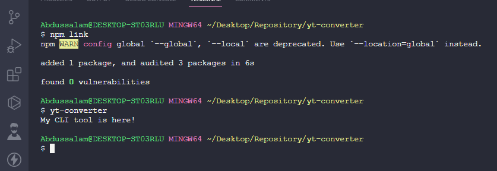

## This file include the steps I took in creating the CLI tool
After successfully setting my node environment, I added `#!/usr/bin/env node` to my index.js file. It is called a shebang or hashbang, and it serves a specific purpose in Unix-like operating systems (including Linux and macOS). It is not specific to Node.js but is commonly used in Node.js scripts to make them executable from the command line.

After that, I added the below code to my `package.json` file;
```
"bin": {
  "yt-converter": "./index.js"
}
```
The `"bin"` field in a `package.json` file is used to specify command-line commands that are associated with your Node.js package. In this case, `"yt-converter"` is being associated with the `./index.js` script. This means that when you install your package globally or link it locally using npm or yarn (`npm link`), you can use the yt-converter command in the command line to execute the ./index.js script.



This feature is useful when you want to distribute a Node.js script or command-line tool as part of your package. It makes it easy for users to run your script without having to remember the full path to your script file or use `node` explicitly.

Just make sure that your script (`index.js` in this case) has the shebang line (`#!/usr/bin/env node`) at the beginning, as we discussed earlier, so that it can be executed as a standalone command.

### Commander.js
There is an npm package called `commander`- it helps in setting command-line interfaces for Node.js. I installed it `npm install commander`.